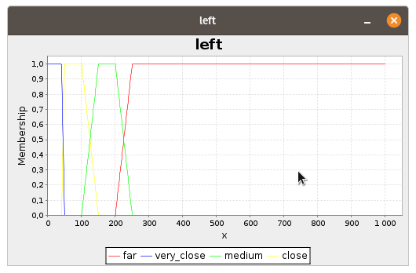
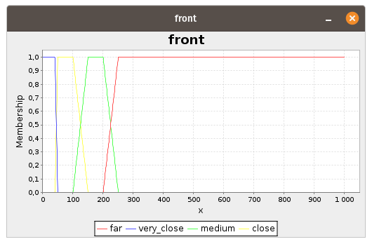
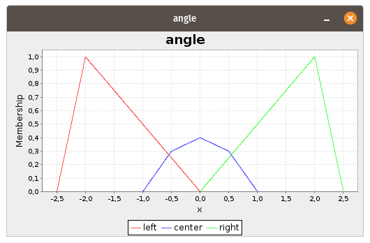
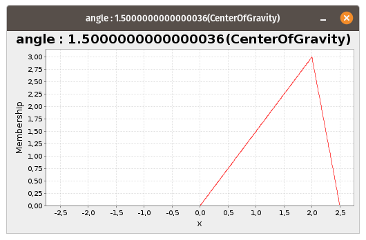
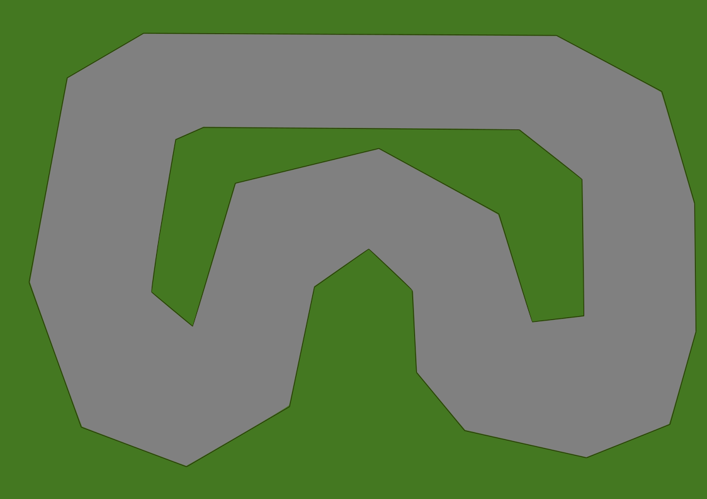

# fuzzyCar

## Symulacja autonomicznego samochodu, korzystającego ze sterownika opartego na logice rozmytej

<p align="center"></p>

## 1. Uruchamianie

```bash
~ cd fuzzyCar
~ chmod +x run.sh
~ ./run.sh
```

## 2. Sterownik

Sterownik oparty o jFuzzyLogic

|   |   |
|---|---|
|   |  |
|   |  |

## 3. Tworzenie tras

Trasy tworzone poprzez odczytanie współrzędnych odcinków z pliku .svg

|   |   |
|---|---|
|  |   |